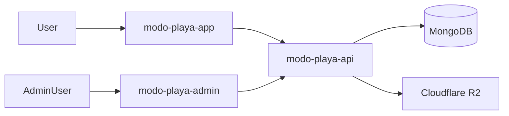

# Modo Playa Platform

[🇬🇧 English](README.md) | [🇪🇸 Español](README.es.md)

Modo Playa Platform documenta el modelo operativo detrás del producto: un catálogo público de alojamientos, una superficie administrativa para dueños y operadores, y un backend multi-tenant que mantiene consistentes los permisos, las reglas de negocio y el manejo de media.

## Repositorios de Código

- [`modo-playa-admin`](https://github.com/matigaleanodev/modo-playa-admin) -> panel de administracion Angular + Ionic
- [`modo-playa-api`](https://github.com/matigaleanodev/modo-playa-api) -> backend multi-tenant en NestJS
- [`modo-playa-app`](https://github.com/matigaleanodev/modo-playa-app) -> catalogo publico

## Por Qué Existe Este Repo

Este repositorio existe para explicar el producto como un sistema coordinado y no como tres aplicaciones aisladas.

La app pública, el panel admin y el backend resuelven problemas distintos. Este repo hace explícita esa separación: descubrimiento para huéspedes, operación para administradores y control compartido en el backend.

## Foco Actual

- preservar un límite claro entre navegación pública y operaciones autenticadas
- mantener centralizadas en el backend las reglas de tenant y permisos
- volver predecible el manejo de media en los flujos administrativos
- documentar la plataforma en términos de operación de producto, no solo de infraestructura

## Arquitectura

## Docs

- [Overview](docs/01-overview.md)
- [Architecture](docs/02-architecture.md)
- [Roadmap](docs/03-roadmap.md)
