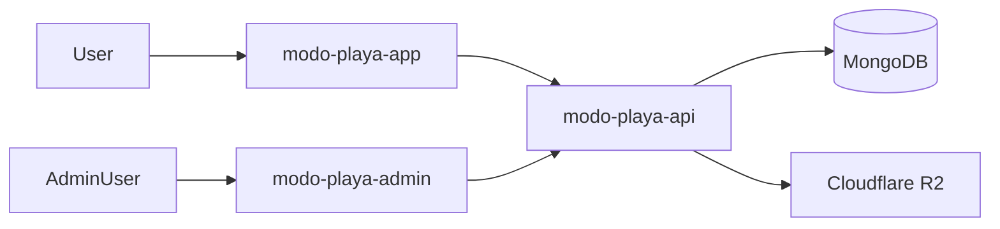

# Modo Playa Platform

[🇬🇧 English](README.md) | [🇪🇸 Español](README.es.md)

Modo Playa Platform documents the operating model behind the product: a public lodging catalog, an admin surface for owners and operators, and a multi-tenant backend that keeps permissions, business rules, and media handling consistent.

## Code Repositories

- [`modo-playa-admin`](https://github.com/matigaleanodev/modo-playa-admin) -> Angular + Ionic admin panel
- [`modo-playa-api`](https://github.com/matigaleanodev/modo-playa-api) -> NestJS multi-tenant backend
- [`modo-playa-app`](https://github.com/matigaleanodev/modo-playa-app) -> public catalog

## Why This Repo Exists

This repository exists to explain the product as a coordinated system instead of three isolated applications.

The public app, admin panel, and backend solve different problems. This repo makes the separation explicit: discovery for guests, operations for admins, and shared control in the backend.

## Current Focus

- preserve a clean boundary between public browsing and authenticated operations
- keep tenant and permission rules centralized in the backend
- make media handling predictable across admin flows
- document the platform in terms of product operations, not just infrastructure

## Architecture

## Docs

- [Overview](docs/01-overview.md)
- [Architecture](docs/02-architecture.md)
- [Roadmap](docs/03-roadmap.md)
